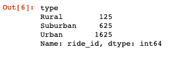
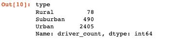
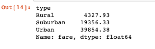
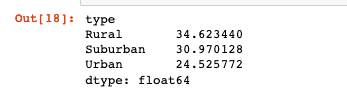
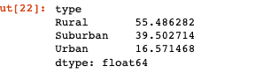
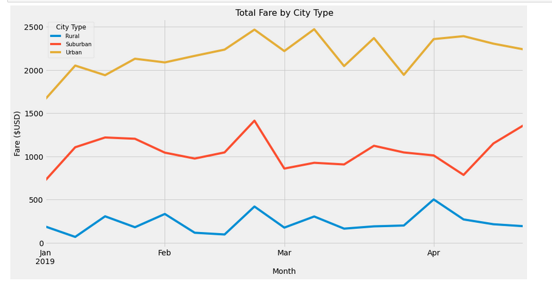

## PyBer-Analysis
Data Visualization Matplotlib PANDAS &amp; SciPy
     

**Overview of the analysis:**

The purpose of this analysis was to exercise learned skills in matplotlib. In this module, we learned how to graph data using the Matplotlib library. Matplotlib has a rich set of features for creating and annotating charts that visualize data in a Data Series or DataFrame. For the PyBer challenge, we used Pandas and Matplotlib to create a multiple line graph that shows the total weekly fares for each type of city (rural, urban, or suburban). This will show how data differs between each city type and allow the client to make informed decisions for the future of their company.

Results:

Total Rides:

Total Drivers:

Total Fares:

From our data displayed above, we found a clear and consistent pattern between the types of cities and the rides provided in each. Urban cities have the most rides, drivers, and fares while the rural cities have the least of these. 

Average Fare per Ride:

Average Fare per Driver:

Total Fare by City Type:

These averages tell us that Urban drivers make the least amount of money per drive while rural drivers make the most. This makes sense because we can infer that urban drivers have shorter trips and more trips per hour of work.

**Summary:**
  
According to the data we have gathered and displayed, we can recommend a couple recommendations in regards to improving business in different types of cities. In rural cities, the average fare cost is higher than any other city and consequently may be discouraging riders from using Pyber's services. By lowering the cost, people may be more inclined to utilize Pyber. On the other hand, urban cities are charging less per ride and paying drivers less per ride. Although most revenue is generated in urban cities, by paying drivers more and encouraging more people to work as Pyber drivers, could result in an increase of rides.
